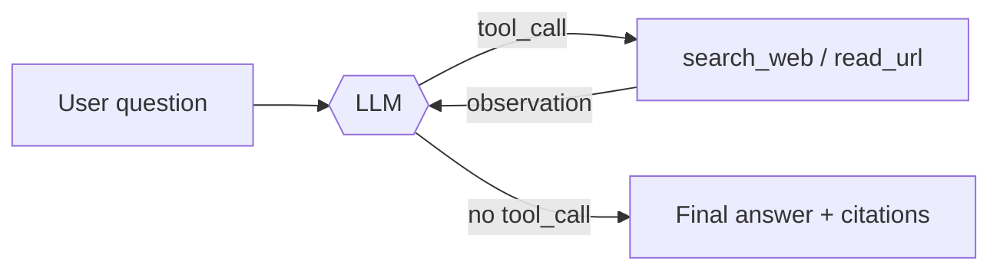

# RnC Assistant (Atlas) — a web-research agent built from scratch


-success)


**Atlas** is an autonomous research agent that answers questions by **searching the web, reading
pages, and reasoning across multiple steps** — then replies with **cited sources**. The entire
agent loop is hand-rolled with the OpenAI tool-calling API and the Python standard library.
**No LangChain, no LlamaIndex, no agent framework** — so every part of the ReAct cycle is visible
and easy to reason about.

It also ships with a small **prompt A/B-test harness** that benchmarks three different agent
"personas" on accuracy, safety (refusal behavior), tool usage, and latency.

---

## Why this project is interesting

- **ReAct from first principles** — a transparent reason → act → observe loop, not a framework abstraction.
- **Tools built on the stdlib** — web search and page reading with zero heavyweight dependencies.
- **Bounded tool budget** — a hard cap on tool calls per question to control latency and token cost.
- **Grounded & cited** — the agent is instructed to search before answering and cite every source.
- **Eval-driven** — a built-in harness compares prompt strategies instead of eyeballing outputs.

---

## How it works



The loop (`run_chad` in `main.py`) runs up to a fixed number of iterations. On each turn the model
either requests a tool call — which is executed and fed back as an `observation` — or returns a
final answer. This is the classic **ReAct** pattern, implemented directly against the chat
completions + tool-calling API.

### Tools

| Tool | What it does | Implementation |
| --- | --- | --- |
| `search_web(query)` | Returns the top 5 web results (title, snippet, URL) | DuckDuckGo HTML endpoint, parsed with `re` |
| `read_url(url)` | Fetches a page and returns clean text (truncated to ~3k chars to protect the context window) | `urllib` + a custom `html.parser` text extractor |

### Prompt strategies + eval harness

The agent ships with three system-prompt **variants**, each a different research persona:

| Variant | Style | Tool budget |
| --- | --- | --- |
| **Concise Analyst** | brief, bullet-point, no fluff | ≤ 3 calls |
| **Thorough Researcher** | multi-source briefing, notes contradictions | up to 5 calls |
| **Structured Reporter** | fixed `Summary / Findings / Sources / Confidence` format | 2–4 calls |

`run_eval_suite()` runs every variant across a set of test cases and `print_summary()` prints a
comparison table. Each `EvalResult` records **answer correctness (expected-keyword match),
refusal/safety behavior, tool-call count, and latency (ms)** — so prompt changes are measured, not
guessed.

---

## Quickstart

```bash
git clone https://github.com/Mayank-Maurya/RNC-Assistant
cd RNC-Assistant
python -m venv venv && source venv/bin/activate
pip install -r requirements.txt

# configure your LLM endpoint
cp .env.example .env
#   OPENROUTER_API_KEY=sk-or-...
#   BASE_URL_OPEN_ROUTER=https://openrouter.ai/api/v1

python main.py        # ask a question / run the agent
```

The model is set in `config.py` (`MODEL`) and works with any **OpenAI-compatible** endpoint —
OpenRouter, a local vLLM/Ollama server, or the OpenAI API.

---

## Tech stack

**Python** · OpenAI Python SDK (tool calling) · OpenRouter / any OpenAI-compatible LLM ·
`urllib` + `html.parser` + `re` (tools, no scraping libs) · `dataclasses` (eval harness) · `litellm`

## Limitations & roadmap

- Search uses DuckDuckGo's HTML endpoint (no API key, but brittle to markup changes) — a pluggable
  search backend (Tavily/SerpAPI) is the natural next step.
- `read_url` does plain text extraction; readability/boilerplate removal would improve grounding.
- The eval harness scores prompt quality on a single LLM turn; extending it to score the **full
  multi-step run** (did it cite correctly? did it stay within budget?) is on the roadmap.

> Built to understand how agents actually work under the hood — by building one without a framework.
